<!-- README.md is generated from README.Rmd. Please edit that file -->

# Análise de dados - Messias

Banco de dados referente à produção da cana-de-açúcar, anos de 2016 a
2018, e atributos do solo.

### Carregando pacotes

``` r
library(tidyverse)
library(sp)
library(vegan)
library(readxl)
library(gstat)
library(plotly)
library(nortest)
library(car)
library(corrplot)
library(GGally)
library(psych)
theme_set(theme_bw())
```

### Arrumando o banco de dados no excel.

``` r
# list_files <- list.files("data-raw", full.names = TRUE)
# 
# my_read_xl <- function(path){
#   read_excel(path) |> 
#     mutate(
#   ano = str_extract(path,"[0-9]+")
#   ) |> relocate(ano)
# }
# my_read_xl(list_files[3])
# dff <- map_df(list_files,my_read_xl)
# write_rds(dff, "data/sugarcane-soil-production.rds")
```

### Lendo o banco em rds

``` r
data_set <- read_rds("data/sugarcane-soil-production.rds")
contorno <- read.table("data/coordenadas-contorno.txt",sep=",",h=TRUE)
p <- Polygon(contorno)
ps <- Polygons(list(p),1)
contorno_ps <- SpatialPolygons(list(ps))
def_pol <- function(x, y, pol){
  as.logical(sp::point.in.polygon(point.x = x,
                                  point.y = y,
                                  pol.x = pol[,1],
                                  pol.y = pol[,2]))
}
```

``` r
x<-data_set$x
y<-data_set$y
dis <- 0.005 #Distância entre pontos
grid <- expand.grid(X=seq(min(x),max(x),dis), Y=seq(min(y),max(y),dis)) |> 
    mutate(flag = def_pol(X,Y,contorno)) |>  
  filter(flag) |> select(-flag)
gridded(grid) = ~ X + Y
plot(grid) 
points(x,y,col="red",pch=4)
```

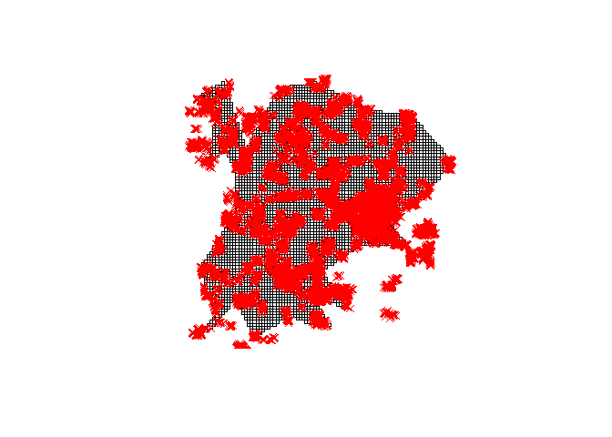<!-- -->

### Conhecendo o Banco de dados

``` r
data_set |> 
  filter(ano == 2016) |> 
  ggplot(aes(x=x, y=y)) +
  geom_point()
```

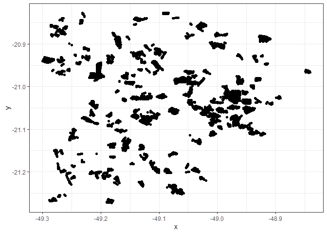<!-- -->

``` r
# ggplotly(plot_graph)
```

``` r
glimpse(data_set)
#> Rows: 15,395
#> Columns: 34
#> $ ano        <chr> "2016", "2016", "2016", "2016", "2016", "2016", "2016", "20…
#> $ ponto      <chr> "CF1658277", "CF1658272", "CF1658273", "CF1658274", "CF1658…
#> $ x          <dbl> -49.18157, -49.18953, -49.18786, -49.18619, -49.18453, -49.…
#> $ y          <dbl> -21.27265, -21.27243, -21.27241, -21.27239, -21.27237, -21.…
#> $ variedade  <chr> "CV6654", "CV6654", "CV6654", "CV6654", "CV6654", "CV6654",…
#> $ solos      <chr> "LVal md", "LVPd md/arg", "LVPd md/arg", "LVPd md/arg", "LV…
#> $ tch_real   <dbl> 63.54, 63.54, 63.54, 63.54, 63.54, 63.54, 63.54, 63.54, 63.…
#> $ atr        <dbl> 148.07, 148.07, 148.07, 148.07, 148.07, 148.07, 148.07, 148…
#> $ ph_cacl2_1 <dbl> 5.19, 5.18, 4.88, 4.96, 5.05, 5.15, 6.24, 4.50, 5.38, 5.50,…
#> $ mo_1       <dbl> 16.2022, 17.0236, 15.6546, 13.7380, 15.6546, 14.0118, 11.82…
#> $ p_resina_1 <dbl> 11.538500, 12.526100, 10.880100, 10.715500, 11.044700, 11.2…
#> $ s_1        <dbl> 8.84769, 9.92472, 12.07878, 8.96736, 9.56571, 8.01000, 9.80…
#> $ ca_1       <dbl> 21.601449, 19.862319, 14.789855, 16.601449, 18.195652, 19.4…
#> $ mg_1       <dbl> 11.045207, 15.713952, 5.495713, 9.696804, 10.047545, 10.359…
#> $ k_1        <dbl> 1.2805516, 0.9239182, 1.4992867, 1.5563481, 1.6229196, 0.84…
#> $ al_1       <dbl> 1.19600, 0.92000, 1.38000, 0.55200, 0.82800, 1.19600, 0.644…
#> $ h_al_1     <dbl> 22.96210, 22.01502, 30.19345, 22.72158, 22.01502, 19.40179,…
#> $ sb_1       <dbl> 33.92721, 36.50019, 21.78485, 27.85460, 29.86612, 30.63469,…
#> $ ctc_1      <dbl> 56.88931, 58.51521, 51.97831, 50.57618, 51.88114, 50.03647,…
#> $ v_1        <dbl> 59.63723, 62.37726, 41.91144, 55.07455, 57.56642, 61.22471,…
#> $ m_1        <dbl> 3.4051560, 2.4585659, 5.9573004, 1.9432103, 2.6975854, 3.75…
#> $ ph_cacl2_2 <dbl> 4.90, 5.38, 5.29, 5.30, 5.16, 5.06, 5.50, 4.50, 4.79, 4.46,…
#> $ mo_2       <dbl> 13.7380, 13.4642, 12.3690, 11.5476, 13.7380, 11.5476, 11.82…
#> $ p_resina_2 <dbl> 12.032300, 11.703100, 11.703100, 13.513700, 11.867700, 11.8…
#> $ s_2        <dbl> 12.43779, 16.86558, 11.00175, 8.12967, 12.19845, 13.27548, …
#> $ ca_2       <dbl> 14.210145, 16.021739, 15.514493, 14.427536, 15.224638, 14.5…
#> $ mg_2       <dbl> 7.085737, 9.735776, 6.563523, 8.262666, 7.327358, 7.475448,…
#> $ k_2        <dbl> 0.8050404, 0.7194484, 0.9429387, 0.5863053, 0.7669995, 0.67…
#> $ al_2       <dbl> 3.956000, 1.012000, 1.104000, 0.736000, 2.024000, 2.852000,…
#> $ h_al_2     <dbl> 43.19156, 26.60941, 24.98024, 21.33044, 24.71858, 26.33069,…
#> $ sb_2       <dbl> 22.100922, 26.476963, 23.020954, 23.276507, 23.318995, 22.7…
#> $ ctc_2      <dbl> 65.29248, 53.08638, 48.00119, 44.60695, 48.03757, 49.05050,…
#> $ v_2        <dbl> 33.84911, 49.87525, 47.95913, 52.18135, 48.54324, 46.31922,…
#> $ m_2        <dbl> 15.182146, 3.681478, 4.576174, 3.065069, 7.986428, 11.15290…
```

``` r
df_aux <- data_set |> 
  filter(ano == 2016) |> 
  select(tch_real:m_1) 
for(i in 1:length(df_aux)){
  x_vari <- as.data.frame(df_aux)[,i]
  print(paste("Variável:",names(df_aux[i])))
  print(lillie.test(x_vari))
}
#> [1] "Variável: tch_real"
#> 
#>  Lilliefors (Kolmogorov-Smirnov) normality test
#> 
#> data:  x_vari
#> D = 0.074837, p-value < 2.2e-16
#> 
#> [1] "Variável: atr"
#> 
#>  Lilliefors (Kolmogorov-Smirnov) normality test
#> 
#> data:  x_vari
#> D = 0.085177, p-value < 2.2e-16
#> 
#> [1] "Variável: ph_cacl2_1"
#> 
#>  Lilliefors (Kolmogorov-Smirnov) normality test
#> 
#> data:  x_vari
#> D = 0.031718, p-value < 2.2e-16
#> 
#> [1] "Variável: mo_1"
#> 
#>  Lilliefors (Kolmogorov-Smirnov) normality test
#> 
#> data:  x_vari
#> D = 0.057769, p-value < 2.2e-16
#> 
#> [1] "Variável: p_resina_1"
#> 
#>  Lilliefors (Kolmogorov-Smirnov) normality test
#> 
#> data:  x_vari
#> D = 0.16676, p-value < 2.2e-16
#> 
#> [1] "Variável: s_1"
#> 
#>  Lilliefors (Kolmogorov-Smirnov) normality test
#> 
#> data:  x_vari
#> D = 0.15265, p-value < 2.2e-16
#> 
#> [1] "Variável: ca_1"
#> 
#>  Lilliefors (Kolmogorov-Smirnov) normality test
#> 
#> data:  x_vari
#> D = 0.089062, p-value < 2.2e-16
#> 
#> [1] "Variável: mg_1"
#> 
#>  Lilliefors (Kolmogorov-Smirnov) normality test
#> 
#> data:  x_vari
#> D = 0.042516, p-value < 2.2e-16
#> 
#> [1] "Variável: k_1"
#> 
#>  Lilliefors (Kolmogorov-Smirnov) normality test
#> 
#> data:  x_vari
#> D = 0.11263, p-value < 2.2e-16
#> 
#> [1] "Variável: al_1"
#> 
#>  Lilliefors (Kolmogorov-Smirnov) normality test
#> 
#> data:  x_vari
#> D = 0.25422, p-value < 2.2e-16
#> 
#> [1] "Variável: h_al_1"
#> 
#>  Lilliefors (Kolmogorov-Smirnov) normality test
#> 
#> data:  x_vari
#> D = 0.078684, p-value < 2.2e-16
#> 
#> [1] "Variável: sb_1"
#> 
#>  Lilliefors (Kolmogorov-Smirnov) normality test
#> 
#> data:  x_vari
#> D = 0.066471, p-value < 2.2e-16
#> 
#> [1] "Variável: ctc_1"
#> 
#>  Lilliefors (Kolmogorov-Smirnov) normality test
#> 
#> data:  x_vari
#> D = 0.062956, p-value < 2.2e-16
#> 
#> [1] "Variável: v_1"
#> 
#>  Lilliefors (Kolmogorov-Smirnov) normality test
#> 
#> data:  x_vari
#> D = 0.062406, p-value < 2.2e-16
#> 
#> [1] "Variável: m_1"
#> 
#>  Lilliefors (Kolmogorov-Smirnov) normality test
#> 
#> data:  x_vari
#> D = 0.29831, p-value < 2.2e-16
```

# PASSO 1

definir o ano e a variável

### Separa o banco de dados por ano e por variáveis

``` r
ano_analise <- 2016
variavel <- "tch_real"
data_set_aux <- data_set |> 
  filter(ano == ano_analise) |> 
  select(x,y,variavel)
names(data_set_aux) <- c("x","y","z")
glimpse(data_set_aux)
#> Rows: 7,961
#> Columns: 3
#> $ x <dbl> -49.18157, -49.18953, -49.18786, -49.18619, -49.18453, -49.18291, -4…
#> $ y <dbl> -21.27265, -21.27243, -21.27241, -21.27239, -21.27237, -21.27176, -2…
#> $ z <dbl> 63.54, 63.54, 63.54, 63.54, 63.54, 63.54, 63.54, 63.54, 63.54, 63.54…
```

### Calcular a média da variável por ponto

``` r
data_set_aux <- data_set_aux |> 
  group_by(x,y) |> 
  summarise(
    z = mean(z,na.rm = TRUE)
  )
```

### Análise exoploratória

``` r
data_set_aux |> 
  pull(z) |> 
  summary()
#>    Min. 1st Qu.  Median    Mean 3rd Qu.    Max. 
#>   30.26   67.38   80.70   82.85  100.23  148.27
```

``` r
data_set_aux |> 
  ggplot(aes(y=z)) +
  geom_boxplot(fill="gray") +
  xlim(-1,1) +
  labs(y = variavel)
```

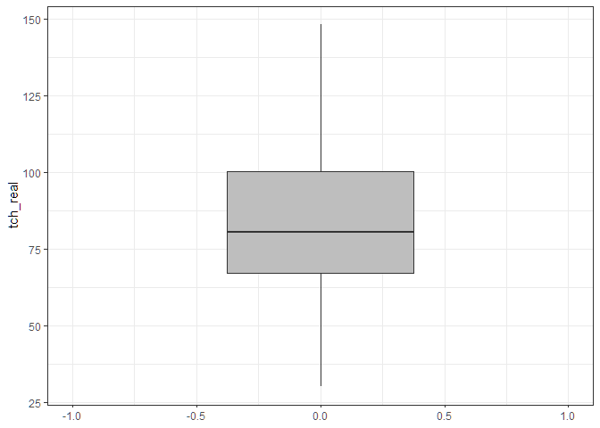<!-- -->

``` r
data_set_aux |> 
  ggplot(aes(x=z)) +
  geom_histogram(fill="gray",color="black",
                 bins = 10) +
  labs(x = variavel)
```

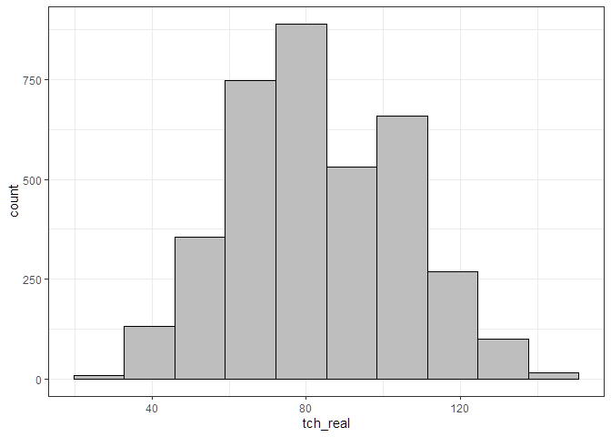<!-- --> Testes de
normalidade

``` r
y <- data_set_aux |> pull(z)
shapiro.test(y)
#> 
#>  Shapiro-Wilk normality test
#> 
#> data:  y
#> W = 0.99016, p-value = 2.374e-15
cvm.test(y)
#> 
#>  Cramer-von Mises normality test
#> 
#> data:  y
#> W = 2.0064, p-value = 7.37e-10
lillie.test(y)
#> 
#>  Lilliefors (Kolmogorov-Smirnov) normality test
#> 
#> data:  y
#> D = 0.051527, p-value < 2.2e-16
ad.test(y)
#> 
#>  Anderson-Darling normality test
#> 
#> data:  y
#> A = 11.356, p-value < 2.2e-16
```

### verificar colinearidade

``` r
cor_matrix <- cor(df_aux, use = "pairwise.complete.obs", method = "pearson")
print(round(cor_matrix, 2))
#>            tch_real   atr ph_cacl2_1  mo_1 p_resina_1   s_1  ca_1  mg_1   k_1
#> tch_real       1.00 -0.08       0.00 -0.05       0.00 -0.08 -0.02  0.00 -0.09
#> atr           -0.08  1.00      -0.05  0.01       0.00  0.04 -0.03  0.00  0.04
#> ph_cacl2_1     0.00 -0.05       1.00  0.07       0.21 -0.04  0.45  0.49  0.27
#> mo_1          -0.05  0.01       0.07  1.00       0.10  0.12  0.31  0.30  0.19
#> p_resina_1     0.00  0.00       0.21  0.10       1.00 -0.04  0.24  0.14  0.13
#> s_1           -0.08  0.04      -0.04  0.12      -0.04  1.00  0.16  0.02  0.22
#> ca_1          -0.02 -0.03       0.45  0.31       0.24  0.16  1.00  0.63  0.26
#> mg_1           0.00  0.00       0.49  0.30       0.14  0.02  0.63  1.00  0.38
#> k_1           -0.09  0.04       0.27  0.19       0.13  0.22  0.26  0.38  1.00
#> al_1          -0.07  0.04      -0.41 -0.03      -0.11  0.15 -0.24 -0.23 -0.10
#> h_al_1        -0.03  0.06      -0.58  0.11      -0.10  0.10 -0.23 -0.24 -0.12
#> sb_1          -0.03 -0.01       0.51  0.34       0.24  0.16  0.96  0.81  0.45
#> ctc_1         -0.04  0.01       0.30  0.39       0.20  0.20  0.89  0.74  0.41
#> v_1            0.00 -0.04       0.73  0.16       0.21 -0.01  0.68  0.69  0.38
#> m_1           -0.06  0.06      -0.51 -0.08      -0.14  0.10 -0.35 -0.36 -0.17
#>             al_1 h_al_1  sb_1 ctc_1   v_1   m_1
#> tch_real   -0.07  -0.03 -0.03 -0.04  0.00 -0.06
#> atr         0.04   0.06 -0.01  0.01 -0.04  0.06
#> ph_cacl2_1 -0.41  -0.58  0.51  0.30  0.73 -0.51
#> mo_1       -0.03   0.11  0.34  0.39  0.16 -0.08
#> p_resina_1 -0.11  -0.10  0.24  0.20  0.21 -0.14
#> s_1         0.15   0.10  0.16  0.20 -0.01  0.10
#> ca_1       -0.24  -0.23  0.96  0.89  0.68 -0.35
#> mg_1       -0.23  -0.24  0.81  0.74  0.69 -0.36
#> k_1        -0.10  -0.12  0.45  0.41  0.38 -0.17
#> al_1        1.00   0.33 -0.26 -0.14 -0.44  0.89
#> h_al_1      0.33   1.00 -0.26  0.11 -0.74  0.37
#> sb_1       -0.26  -0.26  1.00  0.93  0.76 -0.38
#> ctc_1      -0.14   0.11  0.93  1.00  0.50 -0.26
#> v_1        -0.44  -0.74  0.76  0.50  1.00 -0.59
#> m_1         0.89   0.37 -0.38 -0.26 -0.59  1.00

# Visualizar a matriz de correlação
corrplot(cor_matrix, method = "circle", type = "upper", tl.cex = 0.8)
```

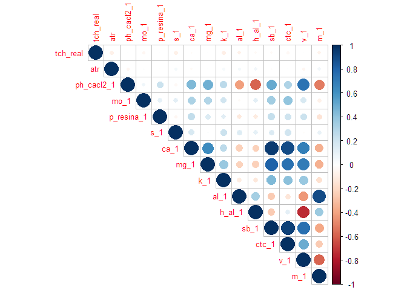<!-- -->

``` r
# Análise de multicolinearidade com VIF
# É necessário ajustar um modelo linear com todas as variáveis independentes
# Exemplo: escolha uma variável dependente qualquer (ex: y)
modelo <- lm(tch_real~ ., data = df_aux)
vif_valores <- vif(modelo)
print(vif_valores)
#>         atr  ph_cacl2_1        mo_1  p_resina_1         s_1        ca_1 
#>    1.010858    2.278067    1.210326    1.099189    1.178735 1020.087715 
#>        mg_1         k_1        al_1      h_al_1        sb_1       ctc_1 
#>  158.879261   40.929103    5.909507  749.244697 7548.235607 5299.681632 
#>         v_1         m_1 
#>   17.587732    7.853745
```

``` r
# Identificar variáveis com VIF alto (>5 ou >10, dependendo do critério)
colineares <- vif_valores[vif_valores > 10]
print("Variáveis com possível multicolinearidade:")
#> [1] "Variáveis com possível multicolinearidade:"
print(colineares)
#>       ca_1       mg_1        k_1     h_al_1       sb_1      ctc_1        v_1 
#> 1020.08771  158.87926   40.92910  749.24470 7548.23561 5299.68163   17.58773
```

## Regressão Linear Múltipla

``` r
variaveis_validas <- df_aux |> 
  select(-c(ca_1, mg_1,k_1,h_al_1,sb_1,ctc_1,v_1))

# Criar fórmula dinâmica para regressão
form <- as.formula(paste("tch_real ~", paste(names(variaveis_validas[-1]), collapse = " + ")))

# Ajustar o modelo de regressão múltipla
modelo_final <- lm(form, data = df_aux)

# Resumo do modelo
summary(modelo_final)
#> 
#> Call:
#> lm(formula = form, data = df_aux)
#> 
#> Residuals:
#>    Min     1Q Median     3Q    Max 
#> -60.12 -21.37  -4.73  22.02 112.94 
#> 
#> Coefficients:
#>               Estimate Std. Error t value Pr(>|t|)    
#> (Intercept) 137.590272   6.919202  19.885  < 2e-16 ***
#> atr          -0.211708   0.032111  -6.593 4.58e-11 ***
#> ph_cacl2_1   -2.595574   0.914005  -2.840 0.004526 ** 
#> mo_1         -0.361674   0.103664  -3.489 0.000488 ***
#> p_resina_1    0.003025   0.028851   0.105 0.916492    
#> s_1          -0.369168   0.072253  -5.109 3.31e-07 ***
#> al_1         -1.818618   0.715171  -2.543 0.011012 *  
#> m_1          -0.105953   0.172151  -0.615 0.538264    
#> ---
#> Signif. codes:  0 '***' 0.001 '**' 0.01 '*' 0.05 '.' 0.1 ' ' 1
#> 
#> Residual standard error: 29.52 on 7953 degrees of freedom
#> Multiple R-squared:  0.01774,    Adjusted R-squared:  0.01688 
#> F-statistic: 20.52 on 7 and 7953 DF,  p-value: < 2.2e-16
```

``` r
plot(modelo_final)
```

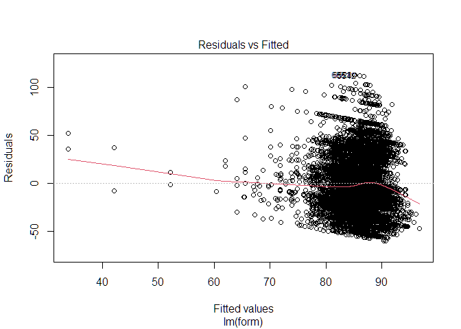<!-- -->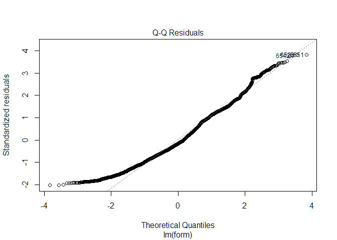<!-- -->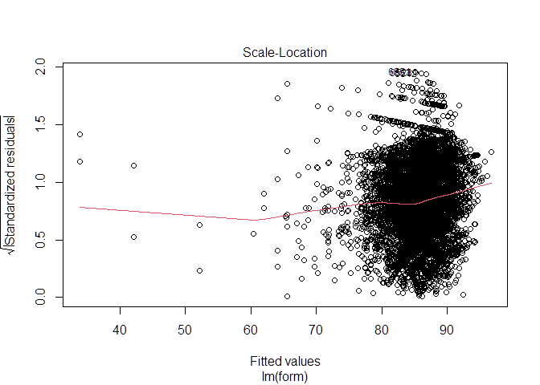<!-- -->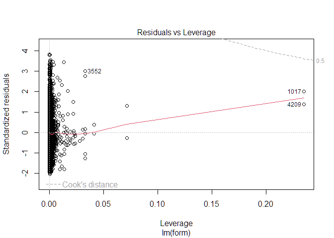<!-- -->

``` r
hist(residuals(modelo_final))
```

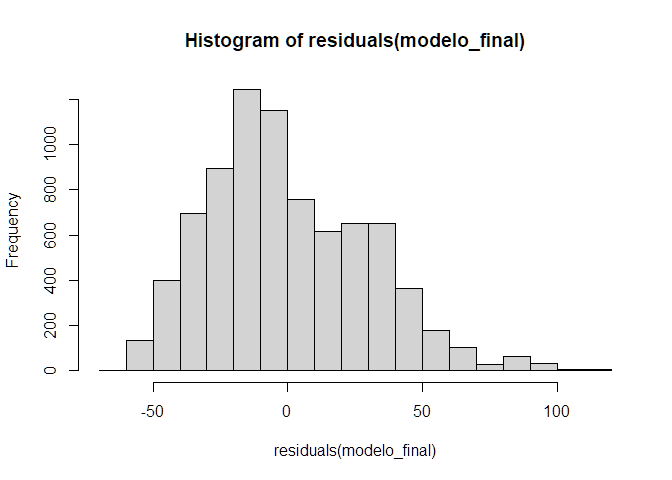<!-- -->

``` r
lmtest::bptest(modelo_final)  # Teste de Breusch-Pagan
#> 
#>  studentized Breusch-Pagan test
#> 
#> data:  modelo_final
#> BP = 55.751, df = 7, p-value = 1.058e-09
lmtest::dwtest(modelo_final)
#> 
#>  Durbin-Watson test
#> 
#> data:  modelo_final
#> DW = 1.3059, p-value < 2.2e-16
#> alternative hypothesis: true autocorrelation is greater than 0
```

## Stepwise Forward usando

``` r
# Modelo nulo (apenas intercepto)
modelo_nulo <- lm(tch_real ~ 1, data = variaveis_validas)

# Modelo completo (com todas as variáveis explicativas)
modelo_completo <- lm(tch_real ~ ., data = variaveis_validas)

# Aplicar Stepwise Forward com base no critério AIC
modelo_step_forward <- step(
  object = modelo_nulo,
  scope = list(lower = modelo_nulo, upper = modelo_completo),
  direction = "forward",
  trace = TRUE
)
#> Start:  AIC=54034.62
#> tch_real ~ 1
#> 
#>              Df Sum of Sq     RSS   AIC
#> + atr         1     43536 7013071 53987
#> + s_1         1     40239 7016367 53991
#> + al_1        1     38820 7017787 53993
#> + m_1         1     26613 7029993 54007
#> + mo_1        1     15442 7041164 54019
#> <none>                    7056607 54035
#> + p_resina_1  1        10 7056597 54037
#> + ph_cacl2_1  1         3 7056603 54037
#> 
#> Step:  AIC=53987.35
#> tch_real ~ atr
#> 
#>              Df Sum of Sq     RSS   AIC
#> + s_1         1     36776 6976295 53947
#> + al_1        1     35289 6977782 53949
#> + m_1         1     22966 6990104 53963
#> + mo_1        1     14761 6998309 53973
#> <none>                    7013071 53987
#> + ph_cacl2_1  1        65 7013006 53989
#> + p_resina_1  1         9 7013061 53989
#> 
#> Step:  AIC=53947.5
#> tch_real ~ atr + s_1
#> 
#>              Df Sum of Sq     RSS   AIC
#> + al_1        1   26105.9 6950189 53920
#> + m_1         1   17850.0 6958445 53929
#> + mo_1        1    9955.3 6966340 53938
#> <none>                    6976295 53947
#> + ph_cacl2_1  1     235.8 6976059 53949
#> + p_resina_1  1      29.6 6976266 53949
#> 
#> Step:  AIC=53919.65
#> tch_real ~ atr + s_1 + al_1
#> 
#>              Df Sum of Sq     RSS   AIC
#> + mo_1        1   11499.4 6938690 53908
#> + ph_cacl2_1  1    8062.0 6942127 53912
#> <none>                    6950189 53920
#> + m_1         1     559.0 6949630 53921
#> + p_resina_1  1     510.9 6949678 53921
#> 
#> Step:  AIC=53908.47
#> tch_real ~ atr + s_1 + al_1 + mo_1
#> 
#>              Df Sum of Sq     RSS   AIC
#> + ph_cacl2_1  1    6930.5 6931759 53903
#> <none>                    6938690 53908
#> + p_resina_1  1     136.8 6938553 53910
#> + m_1         1     130.1 6938560 53910
#> 
#> Step:  AIC=53902.51
#> tch_real ~ atr + s_1 + al_1 + mo_1 + ph_cacl2_1
#> 
#>              Df Sum of Sq     RSS   AIC
#> <none>                    6931759 53903
#> + m_1         1    333.56 6931426 53904
#> + p_resina_1  1     13.00 6931746 53904

# Ver resumo do modelo final selecionado
summary(modelo_step_forward)
#> 
#> Call:
#> lm(formula = tch_real ~ atr + s_1 + al_1 + mo_1 + ph_cacl2_1, 
#>     data = variaveis_validas)
#> 
#> Residuals:
#>     Min      1Q  Median      3Q     Max 
#> -60.089 -21.382  -4.688  21.993 112.952 
#> 
#> Coefficients:
#>              Estimate Std. Error t value Pr(>|t|)    
#> (Intercept) 136.44748    6.67046  20.455  < 2e-16 ***
#> atr          -0.21230    0.03209  -6.616 3.93e-11 ***
#> s_1          -0.36687    0.07204  -5.093 3.61e-07 ***
#> al_1         -2.20320    0.35005  -6.294 3.26e-10 ***
#> mo_1         -0.35435    0.10273  -3.449 0.000565 ***
#> ph_cacl2_1   -2.38855    0.84694  -2.820 0.004811 ** 
#> ---
#> Signif. codes:  0 '***' 0.001 '**' 0.01 '*' 0.05 '.' 0.1 ' ' 1
#> 
#> Residual standard error: 29.52 on 7955 degrees of freedom
#> Multiple R-squared:  0.01769,    Adjusted R-squared:  0.01707 
#> F-statistic: 28.66 on 5 and 7955 DF,  p-value: < 2.2e-16
```

## Análise de Componentes Principais

``` r
da <- variaveis_validas[-1]
mc <- cor(da)
corrplot::corrplot(mc)
```

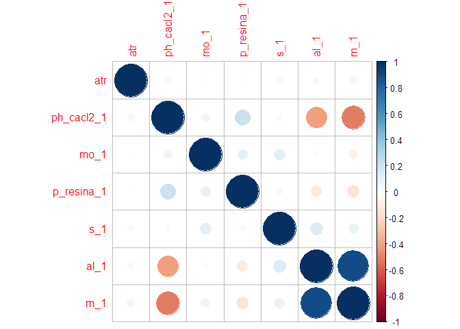<!-- -->

``` r
print("======== Análise de Agrupamento Hierárquico ========== ")
#> [1] "======== Análise de Agrupamento Hierárquico ========== "
da_pad<-decostand(da, 
                  method = "standardize",
                  na.rm=TRUE)
da_pad_euc<-vegdist(da_pad,"euclidean") 
da_pad_euc_ward<-hclust(da_pad_euc, method="ward.D")
plot(da_pad_euc_ward, 
     ylab="Distância Euclidiana",
     xlab="Acessos", hang=-1,
     col="blue", las=1,
     cex=.6,lwd=1.5);box()
```

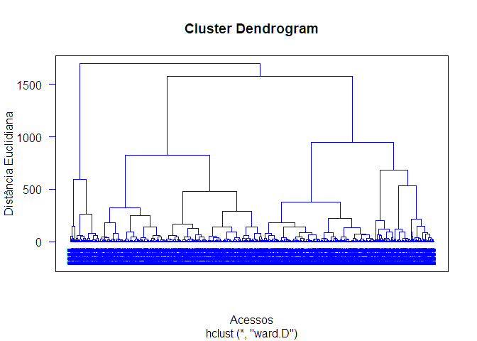<!-- -->

``` r

grupo<-cutree(da_pad_euc_ward,3)
```

``` r
print("======== Análise de Componentes Principais ========== ")
#> [1] "======== Análise de Componentes Principais ========== "
pca <-  prcomp(da_pad,scale.=TRUE)
# Autovalores
eig<-pca$sdev^2
print("==== Autovalores ====")
#> [1] "==== Autovalores ===="
print(round(eig,3))
#> [1] 2.329 1.157 0.989 0.975 0.836 0.617 0.097
print("==== % da variância explicada ====")
#> [1] "==== % da variância explicada ===="
ve<-eig/sum(eig)
print(round(ve,4))
#> [1] 0.3327 0.1653 0.1412 0.1393 0.1194 0.0881 0.0139
print("==== % da variância explicada acumulada ====")
#> [1] "==== % da variância explicada acumulada ===="
print(round(cumsum(ve),4)*100)
#> [1]  33.27  49.80  63.93  77.86  89.80  98.61 100.00
print("==== Poder Discriminante ====")
#> [1] "==== Poder Discriminante ===="
mcor<-cor(da_pad,pca$x)
corrplot(mcor)
```

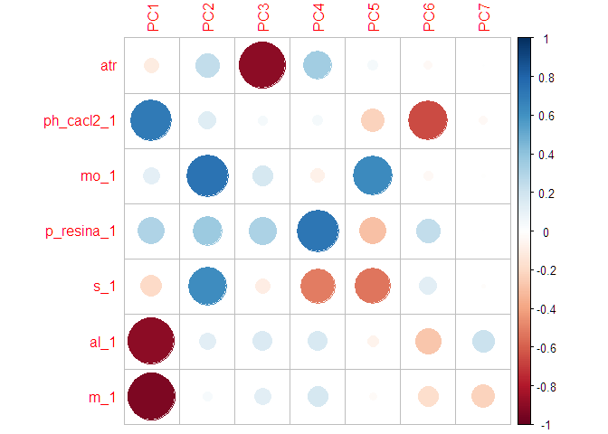<!-- -->

``` r
print("==== screeplot ====")
#> [1] "==== screeplot ===="
screeplot(pca)
abline(h=1)
```

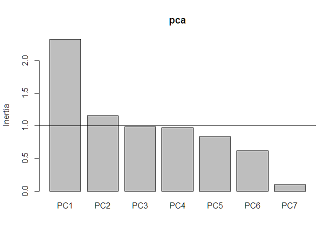<!-- -->

``` r
pc1V<-cor(da_pad,pca$x)[,1]/sd(cor(da_pad,pca$x)[,1])
pc2V<-cor(da_pad,pca$x)[,2]/sd(cor(da_pad,pca$x)[,2])
pc3V<-cor(da_pad,pca$x)[,3]/sd(cor(da_pad,pca$x)[,3])
pc1c<-pca$x[,1]/sd(pca$x[,1])
pc2c<-pca$x[,2]/sd(pca$x[,2])
pc3c<-pca$x[,3]/sd(pca$x[,3])
nv<-ncol(da) # número de variáveis utilizadas na análise
```

``` r
# gráfico biplot
bip<-data.frame(pc1c,pc2c,pc3c,grupo)
texto <- data.frame(
  x = pc1V,
  y = pc2V,
  z = pc3V,
  label = names(da)
)

bip |> 
  ggplot(aes(x=pc1c,y=pc2c,color=as_factor(grupo)))+
  geom_point(size = 3) + 
  theme_minimal() +
  scale_shape_manual(values=16:18)+
  scale_color_manual(values=c("#009E73", "#999999","#D55E00")) +
  #annotate(geom="text", x=pc1V, y=pc2V, label=names(pc1V),
  #            color="black",font=3)+
  geom_vline(aes(xintercept=0),
             color="black", size=1)+
  geom_hline(aes(yintercept=0),
             color="black", size=1)+
  annotate(geom="segment",
           x=rep(0,length(da)),
           xend=texto$x,
           y=rep(0,length(da)),
           yend=texto$y,color="black",lwd=.5)+
  geom_label(data=texto,aes(x=x,y=y,label=label),
             color="black",angle=0,fontface="bold",size=4,fill="white")+
  labs(x=paste("CP1 (",round(100*ve[1],2),"%)",sep=""),
       y=paste("CP2 (",round(100*ve[2],2),"%)",sep=""),
       color="",shape="")+
  theme(legend.position = "top")
```

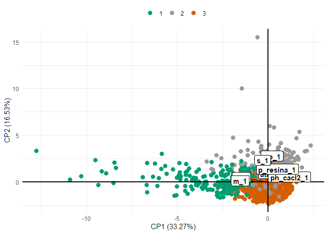<!-- -->

``` r
data_set |> 
  filter(ano == 2016) |> 
  add_column(grupo) |> 
  ggplot(aes(x=x,y=y,color=as_factor(grupo))) +
  geom_point() +
  labs(color = "Grupo")
```

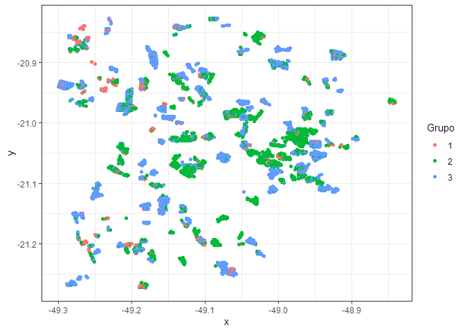<!-- -->

``` r
print("==== Tabela da correlação dos atributos com cada PC ====")
#> [1] "==== Tabela da correlação dos atributos com cada PC ===="
    ck<-sum(pca$sdev^2>=0.98)
    tabelapca<-vector()
    for( l in 1:ck) tabelapca<-cbind(tabelapca,mcor[,l])
    colnames(tabelapca)<-paste(rep(c("PC"),ck),1:ck,sep="")
    pcat<-round(tabelapca,3)
    tabelapca<-tabelapca[order(abs(tabelapca[,1])),]
    print(tabelapca)
#>                   PC1        PC2         PC3
#> atr        -0.1004881 0.24040055 -0.89890939
#> mo_1        0.1155976 0.73783397  0.17427835
#> s_1        -0.1938312 0.62173371 -0.09287938
#> p_resina_1  0.3035842 0.36300190  0.31733229
#> ph_cacl2_1  0.7040796 0.13901012  0.04196084
#> al_1       -0.8991725 0.12520981  0.15568072
#> m_1        -0.9336846 0.03867862  0.12249934
```

## Modeloando com as 3 primeira CPS

``` r
df_aux <- df_aux |> 
  add_column(pc1c,pc2c,pc3c)

# Análise de multicolinearidade com VIF
# É necessário ajustar um modelo linear com todas as variáveis independentes
# Exemplo: escolha uma variável dependente qualquer (ex: y)
modelo <- lm(tch_real~ ., data = df_aux[-c(2:16)])
vif_valores <- vif(modelo)
print(vif_valores)
#> pc2c pc3c 
#>    1    1
```

``` r
# Identificar variáveis com VIF alto (>5 ou >10, dependendo do critério)
colineares <- vif_valores[vif_valores > 10]
print("Variáveis com possível multicolinearidade:")
#> [1] "Variáveis com possível multicolinearidade:"
print(colineares)
#> named numeric(0)
```

## Regressão Linear Múltipla

``` r
variaveis_validas <-  df_aux[-c(2:16)]

# Criar fórmula dinâmica para regressão
form <- as.formula(paste("tch_real ~", paste(names(variaveis_validas[-1]), collapse = " + ")))

# Ajustar o modelo de regressão múltipla
modelo_final <- lm(form, data = df_aux)

# Resumo do modelo
summary(modelo_final)
#> 
#> Call:
#> lm(formula = form, data = df_aux)
#> 
#> Residuals:
#>     Min      1Q  Median      3Q     Max 
#> -60.582 -21.697  -4.664  22.221 114.521 
#> 
#> Coefficients:
#>             Estimate Std. Error t value Pr(>|t|)    
#> (Intercept)  85.6947     0.3317 258.313  < 2e-16 ***
#> pc2c         -2.8689     0.3318  -8.647  < 2e-16 ***
#> pc3c          1.5298     0.3318   4.611 4.07e-06 ***
#> ---
#> Signif. codes:  0 '***' 0.001 '**' 0.01 '*' 0.05 '.' 0.1 ' ' 1
#> 
#> Residual standard error: 29.6 on 7958 degrees of freedom
#> Multiple R-squared:  0.01192,    Adjusted R-squared:  0.01168 
#> F-statistic: 48.02 on 2 and 7958 DF,  p-value: < 2.2e-16
```

``` r
plot(modelo_final)
```

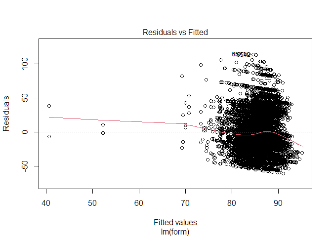<!-- --><!-- -->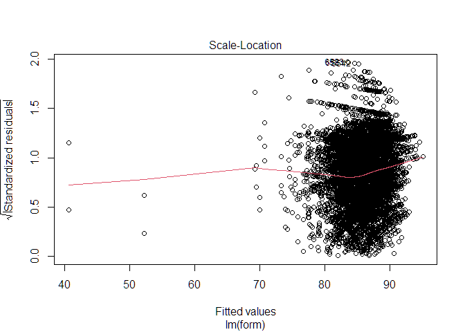<!-- -->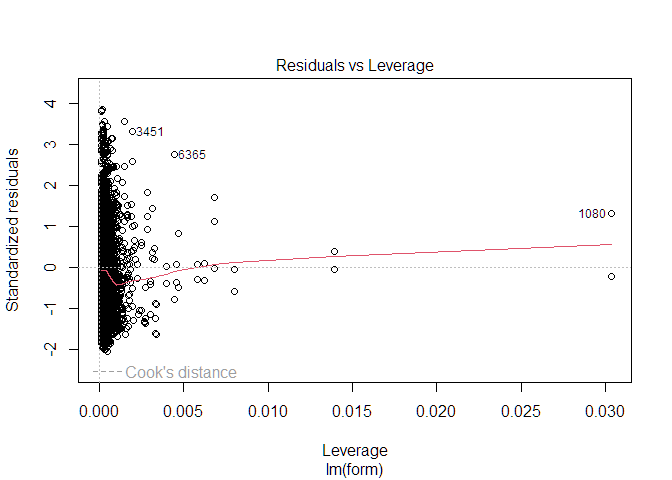<!-- -->

``` r
hist(residuals(modelo_final))
```

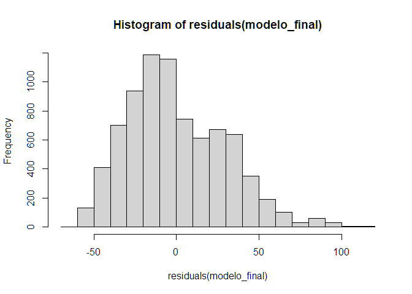<!-- -->

``` r
lmtest::bptest(modelo_final)  # Teste de Breusch-Pagan
#> 
#>  studentized Breusch-Pagan test
#> 
#> data:  modelo_final
#> BP = 30.307, df = 2, p-value = 2.624e-07
lmtest::dwtest(modelo_final)  # Teste de Durbin-Watson test
#> 
#>  Durbin-Watson test
#> 
#> data:  modelo_final
#> DW = 1.3096, p-value < 2.2e-16
#> alternative hypothesis: true autocorrelation is greater than 0
```

## Stepwise Forward usando

``` r
# Modelo nulo (apenas intercepto)
modelo_nulo <- lm(tch_real ~ 1, data = variaveis_validas)

# Modelo completo (com todas as variáveis explicativas)
modelo_completo <- lm(tch_real ~ ., data = variaveis_validas)

# Aplicar Stepwise Forward com base no critério AIC
modelo_step_forward <- step(
  object = modelo_nulo,
  scope = list(lower = modelo_nulo, upper = modelo_completo),
  direction = "forward",
  trace = TRUE
)
#> Start:  AIC=54034.62
#> tch_real ~ 1
#> 
#>        Df Sum of Sq     RSS   AIC
#> + pc2c  1     65516 6991090 53962
#> + pc3c  1     18629 7037977 54016
#> <none>              7056607 54035
#> 
#> Step:  AIC=53962.36
#> tch_real ~ pc2c
#> 
#>        Df Sum of Sq     RSS   AIC
#> + pc3c  1     18629 6972461 53943
#> <none>              6991090 53962
#> 
#> Step:  AIC=53943.12
#> tch_real ~ pc2c + pc3c

# Ver resumo do modelo final selecionado
summary(modelo_step_forward)
#> 
#> Call:
#> lm(formula = tch_real ~ pc2c + pc3c, data = variaveis_validas)
#> 
#> Residuals:
#>     Min      1Q  Median      3Q     Max 
#> -60.582 -21.697  -4.664  22.221 114.521 
#> 
#> Coefficients:
#>             Estimate Std. Error t value Pr(>|t|)    
#> (Intercept)  85.6947     0.3317 258.313  < 2e-16 ***
#> pc2c         -2.8689     0.3318  -8.647  < 2e-16 ***
#> pc3c          1.5298     0.3318   4.611 4.07e-06 ***
#> ---
#> Signif. codes:  0 '***' 0.001 '**' 0.01 '*' 0.05 '.' 0.1 ' ' 1
#> 
#> Residual standard error: 29.6 on 7958 degrees of freedom
#> Multiple R-squared:  0.01192,    Adjusted R-squared:  0.01168 
#> F-statistic: 48.02 on 2 and 7958 DF,  p-value: < 2.2e-16
```

## Modelagem do semivariograma

``` r
data_set_aux |> 
  ggplot(aes(x=x,y=y,color=z)) +
  geom_point() +
  labs(color = variavel)
```

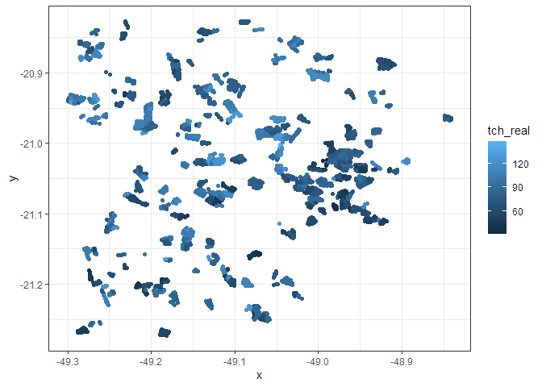<!-- -->

### Análise geoestatística

Criar o arquivo para análise

``` r
coordinates(data_set_aux) = ~ x + y  
form <- z ~ 1 # fórmula da função variogram
```

## PASSO 2

Construir o semivariograma experimental

``` r
vari_exp <- variogram(form, data = data_set_aux,
                      cressie = FALSE,
                      cutoff = 0.20, # distância máxima do semivariograma
                      width = .008) # distancia entre pontos
vari_exp  |>  
 ggplot(aes(x=dist, y=gamma)) +
 geom_point() +
 labs(x="lag (º)",
      y=expression(paste(gamma,"(h)")))
```

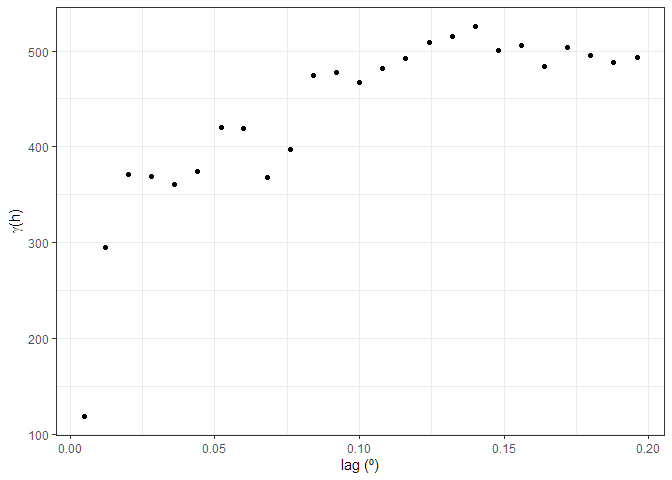<!-- -->

#### Escolha do melhor modelo

``` r
patamar=400
alcance=0.05
epepita=0
modelo_1 <- fit.variogram(vari_exp,vgm(patamar,"Sph",alcance,epepita))
modelo_2 <- fit.variogram(vari_exp,vgm(patamar,"Exp",alcance,epepita))
modelo_3 <- fit.variogram(vari_exp,vgm(patamar,"Gau",alcance,epepita))
sqr.f1<-round(attr(modelo_1, "SSErr"),4); c01<-round(modelo_1$psill[[1]],4); c0_c11<-round(sum(modelo_1$psill),4);a1<-round(modelo_1$range[[2]],2)
sqr.f2<-round(attr(modelo_2, "SSErr"),4); c02<-round(modelo_2$psill[[1]],4); c0_c12<-round(sum(modelo_2$psill),4);a2<-round(3*modelo_2$range[[2]],2)
sqr.f3<-round(attr(modelo_3, "SSErr"),4); c03<-round(modelo_3$psill[[1]],4); c0_c13<-round(sum(modelo_3$psill),4);a3<-round(modelo_3$range[[2]]*(3^.5),2)

df_aux <- vari_exp |> 
  mutate(
    gamma_m1 = ifelse(dist <= a1, c01 + (c0_c11-c01)*(3/2*(dist/a1)-1/2*(dist/a1)^3),c0_c11),
    gamma_m2 = c02 + (c0_c12-c02)*(1-exp(-3*(dist/a2))),
    gamma_m3 = c03 + (c0_c13-c03)*(1-exp(-3*(dist/a3)^2)),
    residuo_total = (gamma-mean(gamma))^2,
    residuo_mod_1 = (gamma - gamma_m1)^2,
    residuo_mod_2 = (gamma - gamma_m2)^2,
    residuo_mod_3 = (gamma - gamma_m3)^2
  ) |> 
  summarise(
    r2_1=(sum(residuo_total) - sum(residuo_mod_1))/sum(residuo_total), 
    r2_2=(sum(residuo_total) - sum(residuo_mod_2))/sum(residuo_total), 
    r2_3=(sum(residuo_total) - sum(residuo_mod_3))/sum(residuo_total), 
  )
r21<-as.vector(round(df_aux[1],4))
r22<-as.vector(round(df_aux[2],4))
r23<-as.vector(round(df_aux[3],4))

plot(vari_exp,model=modelo_1, col=1,pl=F,pch=16,cex=1.2,cex.main=7,ylab=list("Semivariância",cex=1.3),xlab=list("Distância de Separação h (m)",cex=1.3),main =paste("Esf(C0= ",c01,"; C0+C1= ", c0_c11, "; a= ", a1,"; r2 = ", r21,")",sep=""))
```

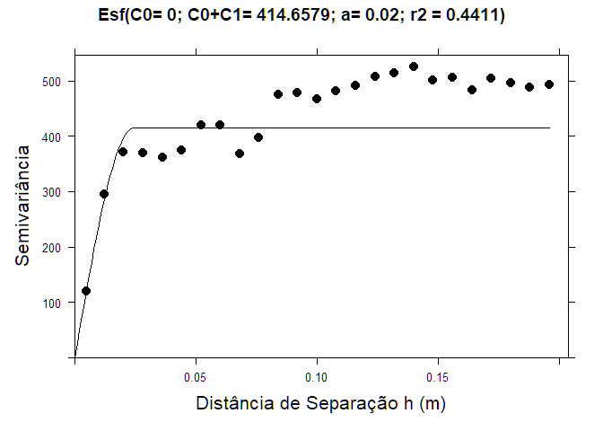<!-- -->

``` r
plot(vari_exp,model=modelo_2, col=1,pl=F,pch=16,cex=1.2,cex.main=7,ylab=list("Semivariância",cex=1.3),xlab=list("Distância de Separação h (m)",cex=1.3),main =paste("Exp(C0= ",c02,"; C0+C1= ", c0_c12, "; a= ", a2,"; r2 = ", r22,")",sep=""))
```

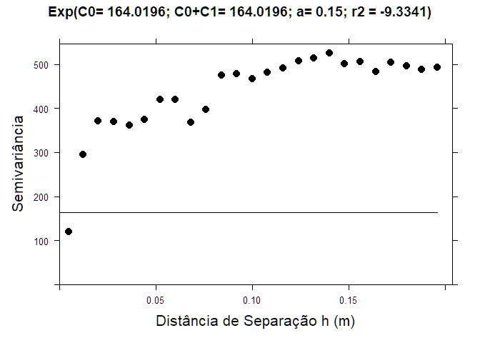<!-- -->

``` r
plot(vari_exp,model=modelo_3, col=1,pl=F,pch=16,cex=1.2,cex.main=7,ylab=list("Semivariância",cex=1.3),xlab=list("Distância de Separação h (m)",cex=1.3),main =paste("Gau(C0= ",c03,"; C0+C1= ", c0_c13, "; a= ", a3,"; r2 = ", r23,")",sep=""))
```

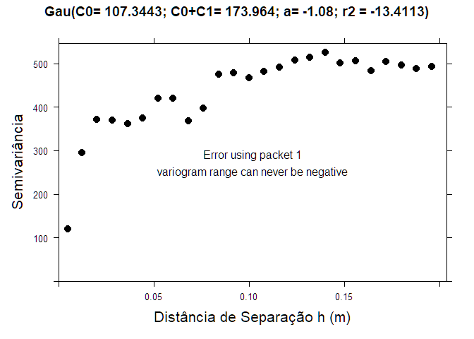<!-- -->

    #>   model     psill      range
    #> 1   Nug 107.34426  0.0000000
    #> 2   Gau  66.61976 -0.6210678

## Validação Cruzada

``` r
conjunto_validacao <- data_set_aux |> 
  as_tibble() |> 
  sample_n(300)
coordinates(conjunto_validacao) = ~x + y
modelos<-list(modelo_1,modelo_2,modelo_3)
for(j in 1:3){
    est<-0
    # vari<-as.character(form)[2]
    for(i in 1:nrow(conjunto_validacao)){
        valid <- krige(formula=form, conjunto_validacao[-i,], conjunto_validacao, model=modelos[[j]])
        est[i]<-valid$var1.pred[i]
    }
    obs<-as.data.frame(conjunto_validacao)[,3] 
    RMSE<-round((sum((obs-est)^2)/length(obs))^.5,3)
    mod<-lm(obs~est)
    b<-round(mod$coefficients[2],3)
    se<-round(summary(mod)$coefficients[4],3)
    r2<-round(summary(mod)$r.squared,3) 
    a<-round(mod$coefficients[1],3)
    plot(est,obs,xlab="Estimado", ylab="Observado",pch=j,col="blue",
        main=paste("Modelo = ",modelos[[j]][2,1],"; Coef. Reg. = ", b, " (SE = ",se, ", r2 = ", r2,")\ny intersept = ",a,"RMSE = ",RMSE ))
    abline(lm(obs~est));
    abline(0,1,lty=3)
}
```

## PASSO 3

selecionar o melhor modelo Modelar o semivariograma

``` r
modelo <- modelo_1 ## sempre modificar
plot(vari_exp,model=modelo, col=1,pl=F,pch=16)
```

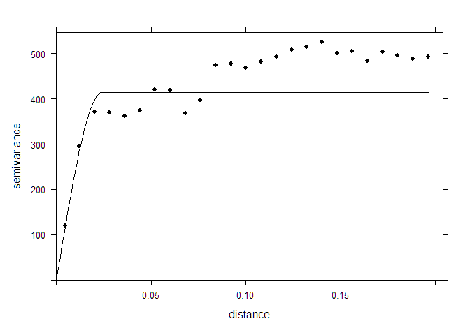<!-- -->

## PASSO 4

### Krigragem ordinária (KO)

Utilizando o algorítmo de KO, vamos estimar xco2 nos locais não
amostrados.

``` r
ko_variavel <- krige(formula=form, data_set_aux, grid, model=modelo, 
    block=c(0,0),
    nsim=0,
    na.action=na.pass,
    debug.level=-1,  
    )
#> [using ordinary kriging]
#>   0% done  1% done  2% done  3% done  4% done  5% done  7% done  9% done 10% done 12% done 14% done 16% done 18% done 20% done 21% done 23% done 24% done 26% done 27% done 28% done 29% done 30% done 31% done 32% done 33% done 34% done 36% done 37% done 39% done 40% done 42% done 43% done 45% done 47% done 49% done 51% done 53% done 55% done 56% done 58% done 59% done 61% done 62% done 64% done 66% done 67% done 69% done 71% done 73% done 75% done 76% done 78% done 80% done 81% done 83% done 85% done 87% done 88% done 90% done 92% done 94% done 95% done 97% done 98% done100% done
```

Mapa de padrão espacial

``` r
mapa <- as.tibble(ko_variavel) |> 
  ggplot(aes(x=X, y=Y)) + 
  geom_tile(aes(fill = var1.pred)) +
  # scale_fill_gradient(low = "yellow", high = "blue") + 
  scale_fill_viridis_c() +
  coord_equal() + 
  labs(fill=variavel,
       x="Longitude",
       y="Latitude")
mapa
```

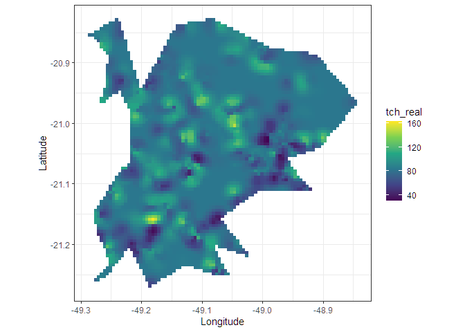<!-- -->

``` r
ggsave(paste0("mapas/krigagem-",variavel,"-",ano_analise,".png"))
```

``` r
# Salvando o arquivo krigado
df <- ko_variavel |> 
  as.tibble() |> 
  mutate(var1.var = sqrt(var1.var)) |> 
  rename(
    !!variavel := var1.pred,
    !!paste0(variavel,"_sd") := var1.var,
  )
write_rds(df,paste0("saida/",variavel,"-",ano_analise,".rds"))
```
