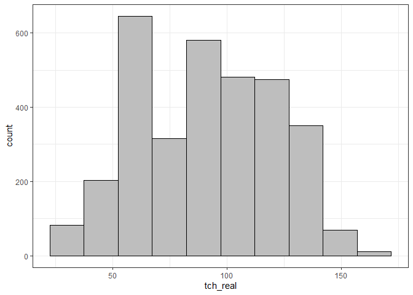
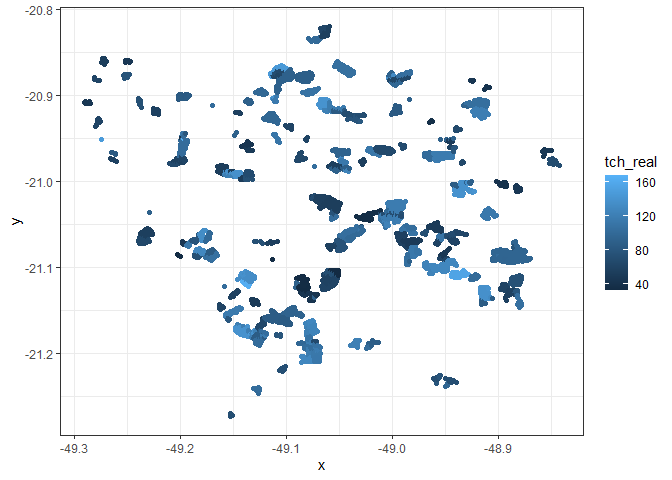
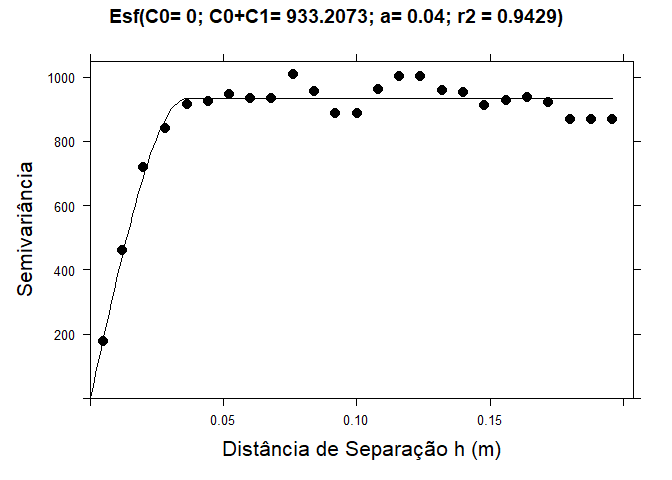

<!-- README.md is generated from README.Rmd. Please edit that file -->

# Análise de dados - Messias

Banco de dados referente à produção da cana-de-açúcar, anos de 2016 a
2018, e atributos do solo.

### Carregando pacotes

``` r
library(tidyverse)
library(sp)
library(vegan)
library(readxl)
library(gstat)
library(plotly)
theme_set(theme_bw())
```

### Arrumando o banco de dados no excel.

``` r
# list_files <- list.files("data-raw", full.names = TRUE)
# 
# my_read_xl <- function(path){
#   read_excel(path) %>% 
#     mutate(
#   ano = str_extract(path,"[0-9]+")
#   ) %>% relocate(ano)
# }
# my_read_xl(list_files[3])
# dff <- map_df(list_files,my_read_xl)
# write_rds(dff, "data/sugarcane-soil-production.rds")
```

### Lendo o banco em rds

``` r
data_set <- read_rds("data/sugarcane-soil-production.rds")
contorno <- read.table("data/coordenadas-contorno.txt",sep=",",h=TRUE)
p <- Polygon(contorno)
ps <- Polygons(list(p),1)
contorno_ps <- SpatialPolygons(list(ps))
def_pol <- function(x, y, pol){
  as.logical(sp::point.in.polygon(point.x = x,
                                  point.y = y,
                                  pol.x = pol[,1],
                                  pol.y = pol[,2]))
}
```

``` r
x<-data_set$x
y<-data_set$y
dis <- 0.005 #Distância entre pontos
grid <- expand.grid(X=seq(min(x),max(x),dis), Y=seq(min(y),max(y),dis)) %>% 
    mutate(flag = def_pol(X,Y,contorno)) %>%  
  filter(flag) %>% select(-flag)
gridded(grid) = ~ X + Y
plot(grid) 
points(x,y,col="red",pch=4,add=TRUE)
```

<!-- -->

### Conhecendo o Banco de dados

``` r
data_set %>% 
  filter(ano == 2016) %>% 
  ggplot(aes(x=x, y=y)) +
  geom_point()
```

<!-- -->

``` r
# ggplotly(plot_graph)
```

``` r
glimpse(data_set)
#> Rows: 15,395
#> Columns: 34
#> $ ano        <chr> "2016", "2016", "2016", "2016", "2016", "2016", "2016", "20…
#> $ ponto      <chr> "CF1658277", "CF1658272", "CF1658273", "CF1658274", "CF1658…
#> $ x          <dbl> -49.18157, -49.18953, -49.18786, -49.18619, -49.18453, -49.…
#> $ y          <dbl> -21.27265, -21.27243, -21.27241, -21.27239, -21.27237, -21.…
#> $ variedade  <chr> "CV6654", "CV6654", "CV6654", "CV6654", "CV6654", "CV6654",…
#> $ solos      <chr> "LVal md", "LVPd md/arg", "LVPd md/arg", "LVPd md/arg", "LV…
#> $ tch_real   <dbl> 63.54, 63.54, 63.54, 63.54, 63.54, 63.54, 63.54, 63.54, 63.…
#> $ atr        <dbl> 148.07, 148.07, 148.07, 148.07, 148.07, 148.07, 148.07, 148…
#> $ ph_cacl2_1 <dbl> 5.19, 5.18, 4.88, 4.96, 5.05, 5.15, 6.24, 4.50, 5.38, 5.50,…
#> $ mo_1       <dbl> 16.2022, 17.0236, 15.6546, 13.7380, 15.6546, 14.0118, 11.82…
#> $ p_resina_1 <dbl> 11.538500, 12.526100, 10.880100, 10.715500, 11.044700, 11.2…
#> $ s_1        <dbl> 8.84769, 9.92472, 12.07878, 8.96736, 9.56571, 8.01000, 9.80…
#> $ ca_1       <dbl> 21.601449, 19.862319, 14.789855, 16.601449, 18.195652, 19.4…
#> $ mg_1       <dbl> 11.045207, 15.713952, 5.495713, 9.696804, 10.047545, 10.359…
#> $ k_1        <dbl> 1.2805516, 0.9239182, 1.4992867, 1.5563481, 1.6229196, 0.84…
#> $ al_1       <dbl> 1.19600, 0.92000, 1.38000, 0.55200, 0.82800, 1.19600, 0.644…
#> $ h_al_1     <dbl> 22.96210, 22.01502, 30.19345, 22.72158, 22.01502, 19.40179,…
#> $ sb_1       <dbl> 33.92721, 36.50019, 21.78485, 27.85460, 29.86612, 30.63469,…
#> $ ctc_1      <dbl> 56.88931, 58.51521, 51.97831, 50.57618, 51.88114, 50.03647,…
#> $ v_1        <dbl> 59.63723, 62.37726, 41.91144, 55.07455, 57.56642, 61.22471,…
#> $ m_1        <dbl> 3.4051560, 2.4585659, 5.9573004, 1.9432103, 2.6975854, 3.75…
#> $ ph_cacl2_2 <dbl> 4.90, 5.38, 5.29, 5.30, 5.16, 5.06, 5.50, 4.50, 4.79, 4.46,…
#> $ mo_2       <dbl> 13.7380, 13.4642, 12.3690, 11.5476, 13.7380, 11.5476, 11.82…
#> $ p_resina_2 <dbl> 12.032300, 11.703100, 11.703100, 13.513700, 11.867700, 11.8…
#> $ s_2        <dbl> 12.43779, 16.86558, 11.00175, 8.12967, 12.19845, 13.27548, …
#> $ ca_2       <dbl> 14.210145, 16.021739, 15.514493, 14.427536, 15.224638, 14.5…
#> $ mg_2       <dbl> 7.085737, 9.735776, 6.563523, 8.262666, 7.327358, 7.475448,…
#> $ k_2        <dbl> 0.8050404, 0.7194484, 0.9429387, 0.5863053, 0.7669995, 0.67…
#> $ al_2       <dbl> 3.956000, 1.012000, 1.104000, 0.736000, 2.024000, 2.852000,…
#> $ h_al_2     <dbl> 43.19156, 26.60941, 24.98024, 21.33044, 24.71858, 26.33069,…
#> $ sb_2       <dbl> 22.100922, 26.476963, 23.020954, 23.276507, 23.318995, 22.7…
#> $ ctc_2      <dbl> 65.29248, 53.08638, 48.00119, 44.60695, 48.03757, 49.05050,…
#> $ v_2        <dbl> 33.84911, 49.87525, 47.95913, 52.18135, 48.54324, 46.31922,…
#> $ m_2        <dbl> 15.182146, 3.681478, 4.576174, 3.065069, 7.986428, 11.15290…
```

### Separa o banco de dados por ano e por variáveis

``` r
ano_analise <- 2016
variavel <- "tch_real"
data_set_aux <- data_set %>% 
  filter(ano == ano_analise) %>% 
  select(x,y,variavel)
names(data_set_aux) <- c("x","y","z")
glimpse(data_set_aux)
#> Rows: 7,961
#> Columns: 3
#> $ x <dbl> -49.18157, -49.18953, -49.18786, -49.18619, -49.18453, -49.18291, -4…
#> $ y <dbl> -21.27265, -21.27243, -21.27241, -21.27239, -21.27237, -21.27176, -2…
#> $ z <dbl> 63.54, 63.54, 63.54, 63.54, 63.54, 63.54, 63.54, 63.54, 63.54, 63.54…
```

### Calcular a média da variável por ponto

``` r
data_set_aux <- data_set_aux %>% 
  group_by(x,y) %>% 
  summarise(
    z = mean(z,na.rm = TRUE)
  )
```

### Análise exoploratória

``` r
data_set_aux %>% 
  pull(z) %>% 
  summary()
#>    Min. 1st Qu.  Median    Mean 3rd Qu.    Max. 
#>   30.26   67.38   80.70   82.85  100.23  148.27
```

``` r
data_set_aux %>% 
  ggplot(aes(y=z)) +
  geom_boxplot(fill="gray") +
  xlim(-1,1) +
  labs(y = variavel)
```

<!-- -->

``` r
data_set_aux %>% 
  ggplot(aes(x=x,y=y,color=z)) +
  geom_point() +
  labs(color = variavel)
```

<!-- -->

### Análise geoestatística

Criar o arquivo para análise

``` r
coordinates(data_set_aux) = ~ x + y  
form <- z ~ 1 # fórmula da função variogram
```

Construir o semivariograma experimental

``` r
vari_exp <- variogram(form, data = data_set_aux,
                      cressie = FALSE,
                      cutoff = 0.3, 
                      width = .005)
vari_exp  %>%  
 ggplot(aes(x=dist, y=gamma)) +
 geom_point() +
 labs(x="lag (º)",
      y=expression(paste(gamma,"(h)")))
```

<!-- -->

Modelar o semivariograma

``` r
modelo <- fit.variogram(vari_exp,
                        vgm(500,"Sph",0.02,0) #psill, mod, alcance, efeito pepita
)
plot(vari_exp,model=modelo, col=1,pl=F,pch=16)
```

<!-- -->

### Krigragem ordinária (KO)

Utilizando o algorítmo de KO, vamos estimar xco2 nos locais não
amostrados.

``` r
ko_variavel <- krige(formula=form, data_set_aux, grid, model=modelo, 
    block=c(0,0),
    nsim=0,
    na.action=na.pass,
    debug.level=-1,  
    )
#> [using ordinary kriging]
#>   0% done  2% done  4% done  6% done  8% done 11% done 13% done 15% done 17% done 19% done 22% done 24% done 26% done 28% done 30% done 32% done 34% done 36% done 39% done 41% done 43% done 45% done 47% done 50% done 52% done 55% done 57% done 60% done 62% done 64% done 67% done 69% done 71% done 73% done 75% done 77% done 79% done 81% done 83% done 85% done 87% done 89% done 91% done 93% done 95% done 97% done 99% done100% done
```

Mapa de padrão espacial

``` r
mapa <- as.tibble(ko_variavel) %>% 
  ggplot(aes(x=X, y=Y)) + 
  geom_tile(aes(fill = var1.pred)) +
  # scale_fill_gradient(low = "yellow", high = "blue") + 
  scale_fill_viridis_c() +
  coord_equal() + 
  labs(fill=variavel,
       x="Longitude",
       y="Latitude")
mapa
```

<!-- -->

``` r
ggsave(paste0("mapas/krigagem-",variavel,"-",ano_analise,".png"))
```

Salvando o arquivo krigado

``` r
df <- ko_variavel %>% 
  as.tibble() %>% 
  mutate(var1.var = sqrt(var1.var)) %>% 
  rename(
    !!variavel := var1.pred,
    !!paste0(variavel,"_sd") := var1.var,
  )
write_rds(df,paste0("saida/",variavel,"-",ano_analise,".rds"))
```
